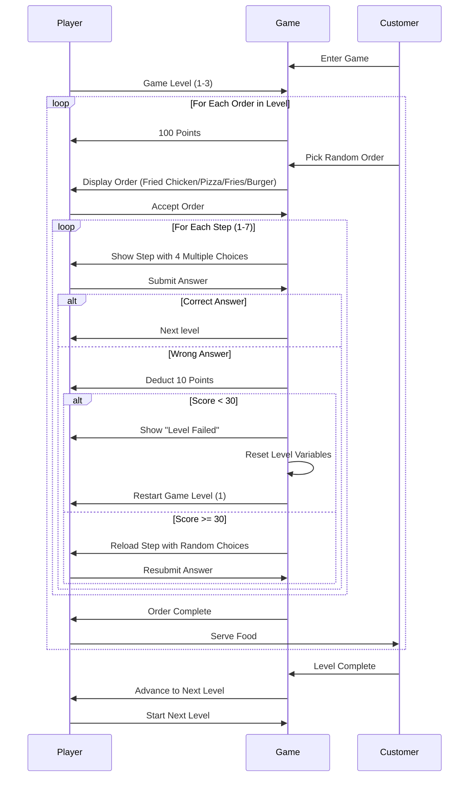

# Over_Food
# Chef-Mode-On

```mermaid
sequenceDiagram
    participant Player
    participant Game
    participant Customer

    Customer->>Game: Enter Game
    Player->>Game: Game Level (1-3)
   
    loop For Each Order in Level
        Game->>Player: 100 Points
        Customer->>Game: Pick Random Order
        Game->>Player: Display Order (Fried Chicken/Pizza/Fries/Burger)
        Player->>Game: Accept Order

        loop For Each Step (1-7)
            Game->>Player: Show Step with 4 Multiple Choices
            Player->>Game: Submit Answer
            
            alt Correct Answer
                Game->>Player: Next level
            else Wrong Answer
                Game->>Player: Deduct 10 Points
                
                alt Score < 30
                    Game->>Player: Show "Level Failed"
                    Game->>Game: Reset Level Variables
                    Game->>Player: Restart Game Level (1)
                else Score >= 30
                    Game->>Player: Reload Step with Random Choices
                    Player->>Game: Resubmit Answer
                end
            end
        end
        
        Game->>Player: Order Complete 
        Player->>Customer: Serve Food
    end

    Customer->>Game: Level Complete
    Game->>Player: Advance to Next Level
    Player->>Game: Start Next Level


```
